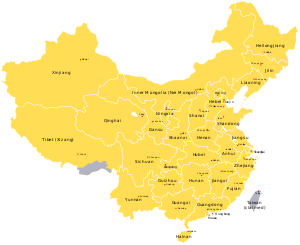

```{r setup, include=FALSE}
knitr::opts_chunk$set(echo = TRUE)

source('Lab1_Part3.R')
source('Lab1_Part2.R')
```
#Part 1
##First
- Beijing, located in [northern China](https://en.wikipedia.org/wiki/North_China), is governed as a [municipality](https://en.wikipedia.org/wiki/Direct-administered_municipalities_of_China) under the direct administration of [central government](https://en.wikipedia.org/wiki/Government_of_the_People%27s_Republic_of_China) with [16 urban, suburban, and rural districts](https://en.wikipedia.org/wiki/List_of_administrative_divisions_of_Beijing). 
- Shanghai is one of the four municipalities under the direct administration of the central government of the People's Republic of China, the largest city in China by population, 
- Municipality
    - A municipality (literally: "direct-administrated city") or municipality directly under the        administration of the central government is a higher level of city which is directly under        the Chinese government, with status/rank equal to that of the provinces. In practice, their       political status is higher than that of common provinces.
- A municipality is a "city" ([Chinese](https://en.wikipedia.org/wiki/Chinese_language); [pinyin](https://en.wikipedia.org/wiki/Pinyin)) with "provincial" power under a unified jurisdiction. As such it is simultaneously a city and a province of its own right.
- A municipality is often not a "[city](https://en.wikipedia.org/wiki/City)" in the usual sense of the term (i.e., a large continuous urban settlement), but instead an administrative unit comprising, typically, a main central urban area (a city in the usual sense, usually with the same name as the municipality), and its much larger surrounding [rural](https://en.wikipedia.org/wiki/Rural) area containing many smaller cities (districts and subdistricts), towns and villages. The larger municipality spans over 100 kilometres (62 mi). To distinguish a "municipality" from its actual urban area (the traditional meaning of the word city), the term "urban area" is used.
- The People's Republic of China (PRC) claims the island of Taiwan and its surrounding islets,     including Penghu, as "Taiwan Province", though Taiwan has not been under control of a government  that ruled from mainland China since 1949, when the Republic of China lost the mainland to the    Communist Party of China, which established the PRC. The territory is controlled by the Republic  of China (ROC, commonly called "Taiwan").
-The whole of Tibet is illegally occupied by PRC.

<center>

</center>

##Second
There are a number of general problems with Chinese statistics. Search for articles that explain some of these problems, read through these articles and write out a summary for the viewer, linking the articles you reference (you can also use blockquotes in markdown). Explain the time periods that might be the least reliable, and maybe summarize some of the suggested methods for "correcting" things like GDP data. (hint: simple google searches for things like "estimating chinese GDP" or "problems with chinese economic statistics" should bring up a wealth of results-try to emphasize academic sources, not news reports).

#Part 2
```{r visualization 1, echo=FALSE, warning=FALSE}
line_grph1
```

Here we have a chart showing the output, in 100 million RMB, for 4 Provinces in China from 1975 through 2017. Output has been relatively flat for these 4 provinces up until 1990. At around that point, there appears to be a divergence in output increase, with some provinces experiencing greater output growth than others. What might explain this? Qinghai and Xinjiang are on the western part of the country, where the terrain is mountainous and fragmented, isolating those areas from the rest of the country. On the other hand, Guangdong and Fujian are along the coast where industrialization and economic activity are greater [(Batisse 2005)](https://journals.openedition.org/chinaperspectives/502).

```{r visualization 2, echo=FALSE, warning=FALSE}
line_grph2
```

Focusing in on Guangdong Province from the previous chart, this chart displays the relationship between the number of enterprises and output. Generally, the greater the number of enterprises the greater the output. Howerver, that isn't always the case as there are some instances of lower numbers of enterprises yet high output. When there are low numbers of enterprises but output remains high, that may be an indicator for greater instances of mergers/acquisitions and/or increased productivity.

```{r visualization 3, echo=FALSE, warning=FALSE}
line_grph3
```

Here are the top 5 provinces (and their enterprise) and the output that they produced from the years 1949 to 2017. These companies had the highest number of units from the start of 1949. As shown, all five companies started with low outputs.  After 1990 is when all five companies started to disperse with different values in output. Jiangsu Enterprise has the highest output with about 143016.94 million RMB in the year 2014 followed by Shandong as a close second with an output of 129906 million RMB in the year 2013. 
Beijing Enterprise has the lowest value of output of 18087.27 million RMB in the year 2016. 

```{r visualization 4, echo=FALSE, warning=FALSE}
line_grph4
```

The fourth presented are provinces whom started small in the beginning. It would be intersesting to see if said provinces grew a substantial amount of output from 1949 to 2017. The provinces that had less than 2 million RMB are: Yunnan, Beijing, Gansu, Xinjiang, Qinghai, and Ningxia. There was not much change from 1949 to 1985. It was not until 1990 where there was a change in output for each province. There was an ongoing trend of staying consistent for the five provinces: Gansu, Ningxia, Qinghai, Xinjiang, and Yunnan as it was approaching the year 2000. There was a huge increase for the province Guangdong as it consistently grew larger outputs than the other five provinces. 
Guangdong went from 9.89 million RMB in 1949 to 9486.79 million RMB in the year 2011. 

```{r visualization 5, echo=FALSE, warning=FALSE}
line_grph5
```

Beijing is symbolized by the blue dots, 
Shanghai is symbolized by the red dots. 

The purpose of this visualization is to compare the economic output between the two wealthiest provinces in China, Beijing and Shanghai. Up until around 1986, both provinces had roughly the same output, but after that year both provinces began to experience exponential growth, with Shanghai's rate of increase in output being higher than Beijing's. 


#Part 3

##First
```{r first, echo=FALSE, warning=FALSE}
plot1
plot2
plot3
```

### How we treated NA Values
We did not modify or remove the NA values during the calculation or while plotting because we believe that there may be a loss in data. Furthermore, we believe the ommission of this values may impact the analysis negatively.

##Second
```{r second, echo=FALSE, warning=FALSE}
national.plot
```

###Analysis
Based on the figure above we noticed that Beijing originally had a large percent of enterprises in the past however, there seems to be a large drop near 1960 and it has been consistent until the early 2000s. Around this period it did increase however, dropped again. Unlike Beijing Tianjing shows a consistent trend until the early 2000s where just like Beijing it increased then the percent of enterprises dropped around the year 2000. Similarly, Shanxi does show an increase in trend before 1960 however, in contrast to the other three provinces the national share total gradually begins to decrease around 1980. Conversely, although Hebei shows an increase in trend before 1960, the national shares total does not decrease. Rather, it gradually increasing but, drops near 2010.


##Third
```{r third, echo=FALSE, warning=FALSE}
output_enterprise
```

###Analysis
Our team noticed that over time the price per enterprise was consistent until it drastically increased around 1997. Similarly, the plot shows that all five provinces increase at a similar rate. However, around 2010 Shanghai showed a large drop in price per enterprise in contrast to the trend that Beijing and Tianjin exhibited. Conversely, both Heilongjiang and Shanghai showed an interesting occurence since both province's trend just stopped around the 2010. Overall, our team noticed that over time all five province's price per enterprise was consistent until 2010 where the ratios started to differ.

